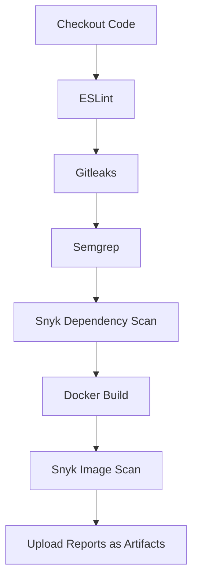

# DevSecOps Security Tooling Guide

> **Scope:** Node.js services and supporting Docker images deployed through the GitHub Actions CI/CD pipeline  
> **Goal:** Detect and block vulnerable code, leaked secrets, and insecure dependencies _before_ they reach production.

---

## 1  Security Tool Stack

| Tool | Primary Purpose | Scan Layer |
|------|-----------------|-----------|
| **Semgrep** | SAST (semantic code analysis) & advanced linting | Source code |
| **ESLint** | Code-style / quality enforcement | Source code |
| **Gitleaks** | Secrets detection (commits & history) | Git |
| **Snyk** | Dependency & container vulnerability scanning | npm packages • Docker image |

---

## 2  Configuration Highlights

### 2.1  Semgrep — SAST & Powerful Linter
| Item | Value |
|------|-------|
| **Execution** | Docker (`returntocorp/semgrep`) inside a GitHub Actions job |
| **Ruleset** | `p/javascript` (plus any custom rules in `.semgrep/`) |
| **Outputs** | `semgrep.json` (`--json`) & optional `semgrep.sarif` |
| **Why** | Finds logic-level bugs and OWASP patterns that simple linters miss |

```bash
semgrep scan \
  --config=p/javascript \
  --json --output=semgrep.json
```

---

### 2.2  ESLint — Style & Basic Lint

* **Runtime:** Node 18 container  
* **Config file:** `eslint.config.js` (flat-config, ESLint v9+)  

```js
// eslint.config.js
export default [
  {
    files: ["**/*.js","**/*.ts"],
    rules: {
      semi:   ["error", "always"],
      quotes: ["error", "double"],
    },
  },
];
```

SARIF upload is enabled so violations surface in **GitHub → Code Scanning**.

---

### 2.3  Gitleaks — Secret Scanner

```bash
gitleaks detect \
  --source=. \
  --report-format=json \
  --report-path=gitleaks-report.json
```

*Scans new commits only* on pull-request jobs; a full-history scan runs nightly on `main`.

---

### 2.4  Snyk — SCA & Container Security

```bash
# Dependency audit
snyk test --all-projects \
  --json-file-output=snyk-deps.json

# Image audit
snyk container test myapp:latest \
  --json-file-output=snyk-image.json
```

* Requires `SNYK_TOKEN` secret.  
* Monitored projects appear in the Snyk SaaS dashboard for ongoing alerts.

---

## 3  CI/CD Flow



A **failing high-severity finding** in any step marks the build red and blocks the merge.

---

## 4  Artifacts & Dashboards

| Artifact | Producer | Format | Consumed By |
|----------|----------|--------|-------------|
| `semgrep.json` | Semgrep | JSON | Long-term S3 store / diff checks |
| `eslint.sarif` | ESLint | SARIF | GitHub Code Scanning |
| `gitleaks-report.json` | Gitleaks | JSON | Security Gate summary |
| `snyk-deps.json` | Snyk (deps) | JSON | Slack alert / Jira ticket |
| `snyk-image.json` | Snyk (img) | JSON | Slack alert / Jira ticket |

**Retention:** 30 days (GitHub artifact retention), then promoted to S3 if the release is tagged.

---

## 5  Security Gates

| Layer | Gate Condition (Fail Build If…) |
|-------|--------------------------------|
| **Secrets** | Any secret classified as *High* |
| **SAST** | Critical or High severity issue not suppressed |
| **SCA** | CVSS ≥ 7 with no available remediation PR |
| **Image** | OS/CVE severity ≥ High |

Thresholds can be relaxed on feature branches (warning-only) but remain strict on `main` and release branches.

---

## 6  Benefits Snapshot

| Security Domain | Tool(s) | Outcome |
|-----------------|---------|---------|
| **Static Code** | Semgrep | Detects logic-level vulns + insecure patterns |
| **Code Quality** | ESLint | Eliminates style drift & obvious bugs |
| **Secrets** | Gitleaks | Prevents API keys reaching remote origin |
| **Dependencies** | Snyk (dep) | Flags vulnerable npm packages early |
| **Containers** | Snyk (img) | Hardens runtime OS & base image |

---

## 7  Future Roadmap (𝘲𝘶𝘪𝘤𝘬 wins)

1. **Push SARIF from Semgrep & ESLint** into GitHub Code Scanning for a single pane of glass.  
2. **ChatOps alerts**: Pipe High/Critical findings to Slack `#sec-alerts`.  
3. **Scorecards**: Automate repo security posture (`ossf/scorecard` action).  
4. **Add Trivy** as a secondary SBOM & image scanner for cross-validation.

---

## 8  References & Links

* [Semgrep Docs](https://semgrep.dev/docs/)  
* [ESLint v9 Migration](https://eslint.org/docs/latest/use/migration-guide)  
* [Gitleaks](https://gitleaks.io/)  
* [Snyk CLI](https://docs.snyk.io/snyk-cli)

---

### Maintainer Notes

* Update this guide when tool versions change (Semgrep ruleset bumps, ESLint major upgrades, etc.).  
* Keep action versions pinned (`uses: snyk/actions/node@v1.14.0`) to prevent breaking builds unexpectedly.  
* Review suppressions quarterly; stale suppressions are an attack surface.

---

**Happy shipping — now in Hard-Mode ™!**
